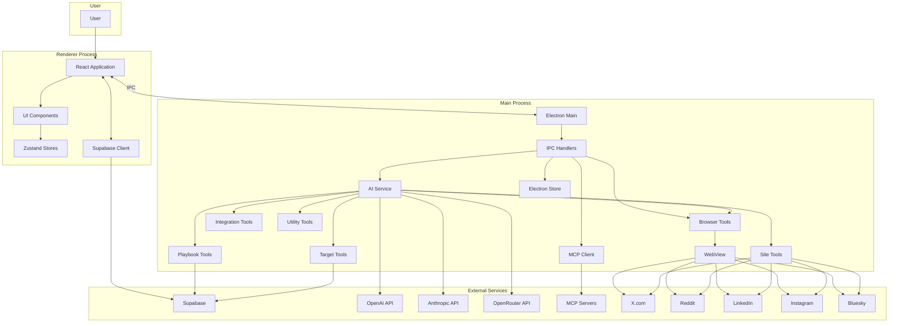
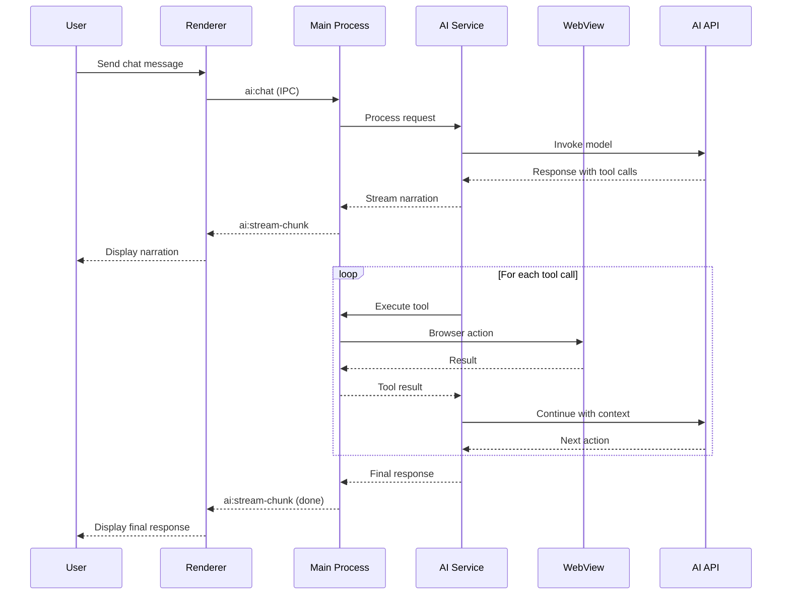
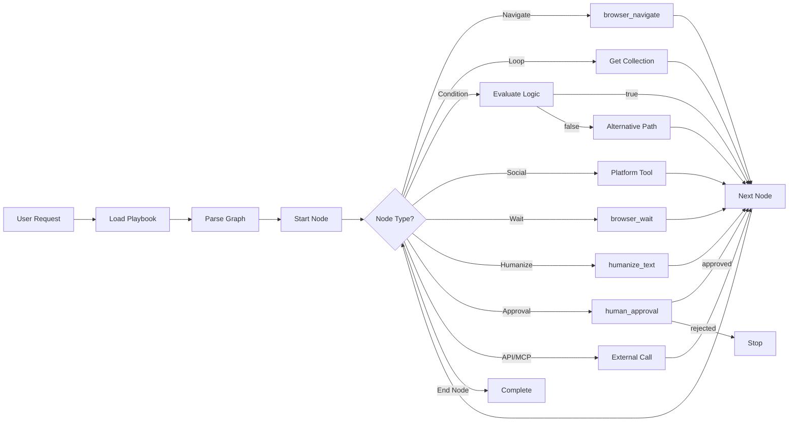
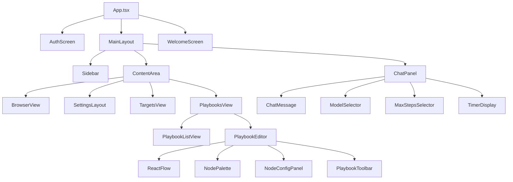
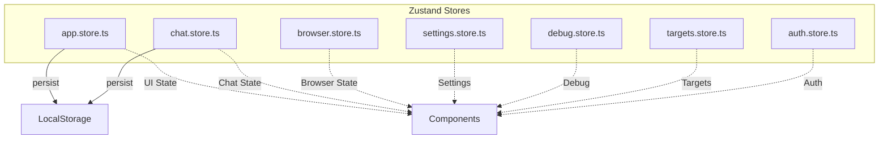
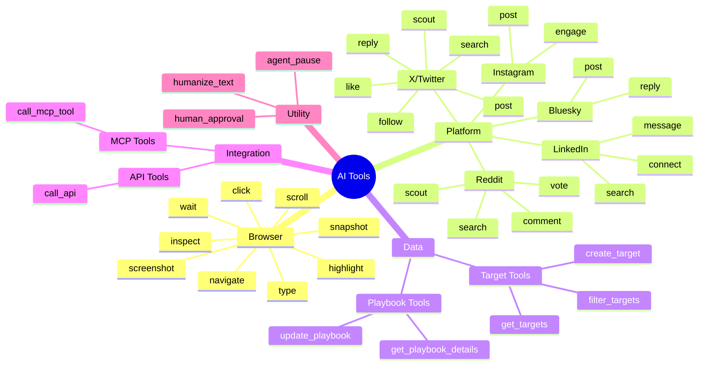

# NavReach Architecture Diagram

## System Architecture

```mermaid
graph TB
    subgraph User
        U[User]
    end

    subgraph Renderer Process
        RP[React Application]
        UI[UI Components]
        ST[Zustand Stores]
        SV[Supabase Client]
    end

    subgraph Main Process
        MP[Electron Main]
        IPC[IPC Handlers]
        AI[AI Service]
        BT[Browser Tools]
        STT[Site Tools]
        TT[Target Tools]
        PT[Playbook Tools]
        IT[Integration Tools]
        UT[Utility Tools]
        MC[MCP Client]
        ES[Electron Store]
        WV[WebView]
    end

    subgraph External Services
        SUP[Supabase]
        OAI[OpenAI API]
        ANT[Anthropic API]
        ORT[OpenRouter API]
        MCP[MCP Servers]
        XCOM[X.com]
        RED[Reddit]
        LIN[LinkedIn]
        INS[Instagram]
        BLU[Bluesky]
    end

    U --> RP
    RP --> UI
    UI --> ST
    RP <--> SV
    SV --> SUP

    RP <-->|IPC| MP
    MP --> IPC
    IPC --> AI
    IPC --> BT
    IPC --> MC
    IPC --> ES

    AI --> BT
    AI --> STT
    AI --> TT
    AI --> PT
    AI --> IT
    AI --> UT

    BT --> WV
    WV --> XCOM
    WV --> RED
    WV --> LIN
    WV --> INS
    WV --> BLU

    STT --> XCOM
    STT --> RED
    STT --> LIN
    STT --> INS
    STT --> BLU

    AI --> OAI
    AI --> ANT
    AI --> ORT
    MC --> MCP

    PT --> SUP
    TT --> SUP
```

## Data Flow

```mermaid
sequenceDiagram
    participant U as User
    participant RP as Renderer
    participant MP as Main Process
    participant AI as AI Service
    participant WV as WebView
    participant API as AI API

    U->>RP: Send chat message
    RP->>MP: ai:chat (IPC)
    MP->>AI: Process request
    AI->>API: Invoke model
    API-->>AI: Response with tool calls
    AI-->>MP: Stream narration
    MP-->>RP: ai:stream-chunk
    RP-->>U: Display narration

    loop For each tool call
        AI->>MP: Execute tool
        MP->>WV: Browser action
        WV-->>MP: Result
        MP-->>AI: Tool result
        AI->>API: Continue with context
        API-->>AI: Next action
    end

    AI-->>MP: Final response
    MP-->>RP: ai:stream-chunk (done)
    RP-->>U: Display final response
```

## Playbook Execution Flow

```mermaid
graph LR
    A[User Request] --> B[Load Playbook]
    B --> C[Parse Graph]
    C --> D[Start Node]
    D --> E{Node Type?}

    E -->|Navigate| F[browser_navigate]
    E -->|Loop| G[Get Collection]
    E -->|Condition| H[Evaluate Logic]
    E -->|Social| I[Platform Tool]
    E -->|Wait| J[browser_wait]
    E -->|Humanize| K[humanize_text]
    E -->|Approval| L[human_approval]
    E -->|API/MCP| M[External Call]

    F --> N[Next Node]
    G --> N
    H -->|true| N
    H -->|false| O[Alternative Path]
    I --> N
    J --> N
    K --> N
    L -->|approved| N
    L -->|rejected| P[Stop]
    M --> N

    O --> N
    N --> E
    E -->|End Node| Q[Complete]
```

## Component Hierarchy

```mermaid
graph TB
    App[App.tsx]
    Auth[AuthScreen]
    Main[MainLayout]
    Welcome[WelcomeScreen]

    App --> Auth
    App --> Main
    App --> Welcome

    Main --> Sidebar
    Main --> ContentArea
    Main --> ChatPanel

    ContentArea --> BrowserView
    ContentArea --> SettingsLayout
    ContentArea --> TargetsView
    ContentArea --> PlaybooksView

    PlaybooksView --> PlaybookListView
    PlaybooksView --> PlaybookEditor

    PlaybookEditor --> ReactFlow
    PlaybookEditor --> NodePalette
    PlaybookEditor --> NodeConfigPanel
    PlaybookEditor --> PlaybookToolbar

    ChatPanel --> ChatMessage
    ChatPanel --> ModelSelector
    ChatPanel --> MaxStepsSelector
    ChatPanel --> TimerDisplay
```

## State Management

```mermaid
graph TB
    subgraph Zustand Stores
        AS[app.store.ts]
        CS[chat.store.ts]
        BS[browser.store.ts]
        SS[settings.store.ts]
        DS[debug.store.ts]
        TS[targets.store.ts]
        AUS[auth.store.ts]
    end

    AS -->|persist| LocalStorage
    CS -->|persist| LocalStorage

    AS -.->|UI State| Components
    CS -.->|Chat State| Components
    BS -.->|Browser State| Components
    SS -.->|Settings| Components
    DS -.->|Debug| Components
    TS -.->|Targets| Components
    AUS -.->|Auth| Components
```

## Tool Categories

```mermaid
mindmap
    root((AI Tools))
        Browser
            navigate
            click
            type
            scroll
            snapshot
            screenshot
            wait
            inspect
            highlight
        Platform
            X/Twitter
                search
                scout
                like
                reply
                post
                follow
            Reddit
                search
                scout
                vote
                comment
            LinkedIn
                search
                connect
                message
            Instagram
                post
                engage
            Bluesky
                post
                reply
        Data
            Target Tools
                create_target
                get_targets
                filter_targets
            Playbook Tools
                get_playbook_details
                update_playbook
        Integration
            API Tools
                call_api
            MCP Tools
                call_mcp_tool
        Utility
            humanize_text
            human_approval
            agent_pause
```
